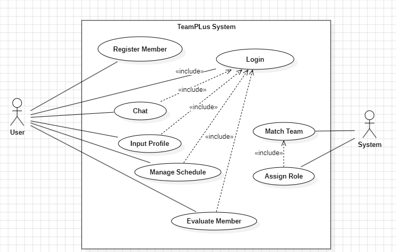
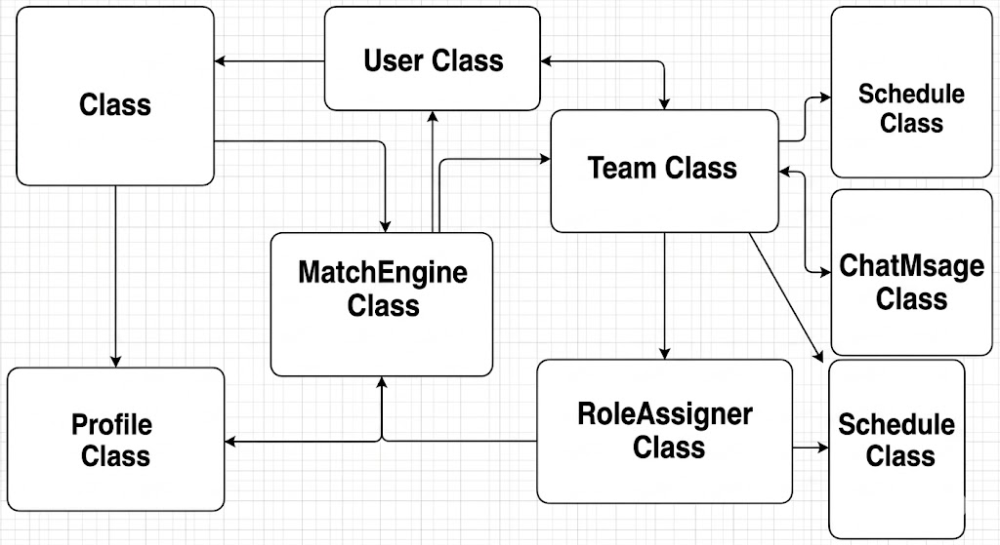
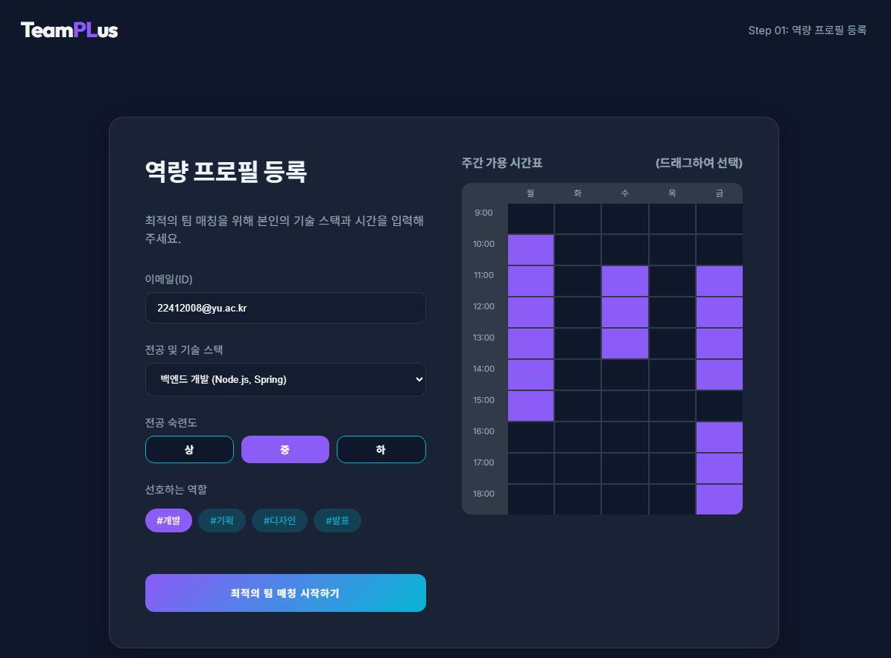
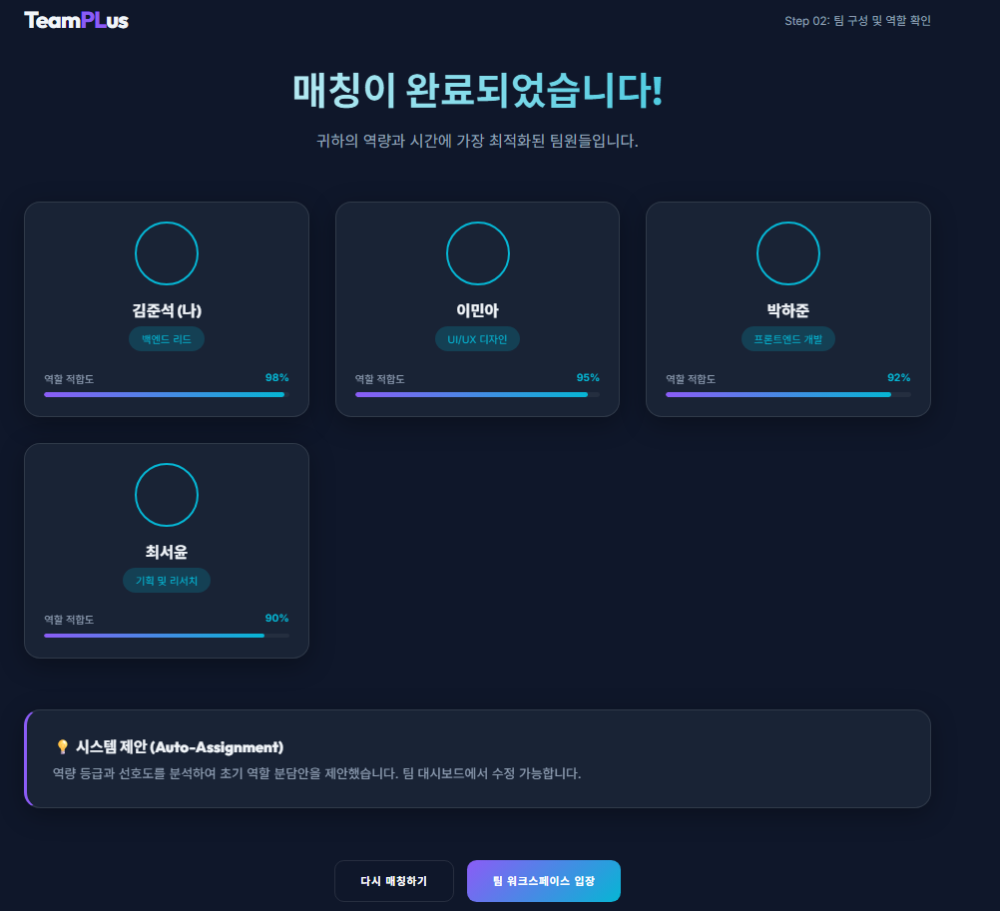
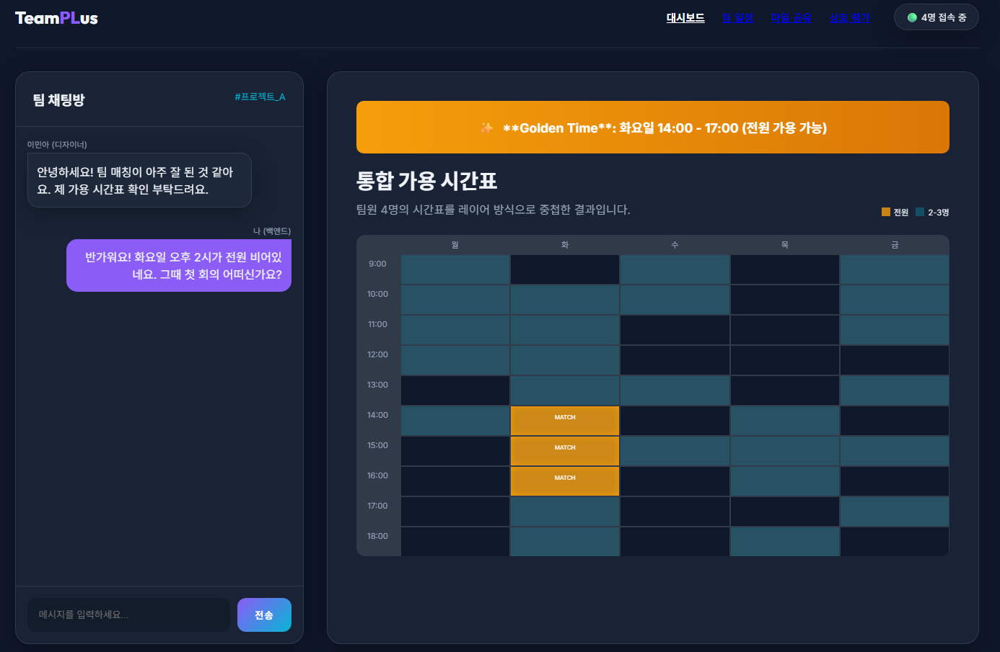

# 2. Analysis

TeamPLus – 팀플 매칭 및 역할 분배 시스템

## [ Revision History ]

| Revision date | Version # | Description | Author |
|---|---|---|---|
| 2026/05/08 | 1.0.0 | 초안 |  |

---

## Contents

1. Introduction
2. Use case analysis
3. Domain analysis
4. User Interface prototype
5. Glossary
6. References

---

## 1. Introduction

### 1) Summary
대학 교육 과정에서 팀 프로젝트는 전공 역량과 협업 능력을 기르는 필수적인 과정이지만, 학생들은 팀 구성 단계부터 큰 어려움을 겪습니다. 기존 커뮤니티는 익명성으로 인해 팀원의 실제 역량을 파악하기 어렵고, 단순히 인원 모집에만 치중되어 있습니다. TeamPLus는 사용자의 기술 스택, 선호 역할, 가용 시간 데이터를 기반으로 최적의 팀을 자동 매칭하고, 역할 분배와 일정 관리까지 지원하는 통합 협업 플랫폼입니다.  

### 2) Business Goals

TeamPLus의 핵심 목표는 ‘데이터 기반의 공정한 팀 구성’과 ‘협업 효율의 극대화’입니다. 인맥이 부족한 학생도 역량만으로 적합한 팀을 찾을 수 있도록 자동 매칭 알고리즘을 제공합니다. 또한 매칭 직후 발생하는 역할 분배 갈등을 줄이기 위해 시스템이 최적의 역할안을 제안하며, 상호 평가 시스템을 통해 무임승차 문제를 방지하고자 합니다.  

### 3) Technical Goals

본 시스템은 사용자별 역량 프로필과 시간 데이터를 정밀하게 처리해야 합니다. 팀 구성 알고리즘은 다수의 사용자 데이터를 분석하여 기술적 균형과 시간적 중첩도를 최적화해야 하며, User, Team, Role 간의 유기적인 데이터 일관성 유지가 필수적입니다.

---

## 2. Use case analysis

### 2.1 Use case diagram

## 2.2 Use case description

### Use case #1 : Register Member
**GENERAL CHARACTERISTICS**
| 항목 | 내용 |
| :--- | :--- |
| **Summary** | 사용자가 시스템의 특정 기능을 사용하기 위해 회원 등록할 때 사용하는 기능 |
| **Scope** | TeamPLus 시스템 |
| **Level** | User Level |
| **Author** | 김준석 |
| **Last Update** | 2026/05/08 |
| **Status** | Analysis |
| **Primary Actor** | User |
| **Preconditions** | 시스템이 설치/접속 가능한 상태여야 한다. 통신이 가능해야 한다. |
| **Trigger** | 로그인 페이지에서 회원가입 버튼을 눌러 회원가입을 하려고 할 때 |
| **Success Post Condition** | 사용자는 로그인을 할 수 있다. |
| **Failed Post Condition** | 사용자는 로그인을 할 수 없다. |

**MAIN SUCCESS SCENARIO**
| Step | Action |
| :--- | :--- |
| 1 | 이 use case는 사용자가 회원가입을 할 때 시작된다. |
| 2 | 회원은 로그인 페이지에서 회원가입 버튼을 누른다. |
| 3 | 시스템은 회원가입 페이지를 띄운다. |
| 4 | 회원은 이메일(ID), Password, 닉네임 등을 입력하고 회원가입 버튼을 누른다. |
| 5 | 시스템은 회원가입이 성공한지(중복 여부 등) 판단한다. |
| 6 | 이 use case는 회원가입이 성공하면 끝난다. |

**EXTENSION SCENARIO**
| Step | Branching Action |
| :--- | :--- |
| 5 | 5a. 통신 문제나 중복된 ID 입력으로 회원가입에 실패한다. |
| | 5a1. 회원가입 실패 메시지를 보여준다. |
| | 5a2. 회원정보 입력 단계로 돌아간다. (Step 4) |

**RELATED INFORMATION**
* **Performance**: < 1 second
* **Frequency**: 사용자당 1번
* **Concurrency**: No Limits

---

### Use case #2 : Login
**GENERAL CHARACTERISTICS**
| 항목 | 내용 |
| :--- | :--- |
| **Summary** | 등록된 사용자가 본인 인증을 통해 시스템 권한을 획득하는 기능 |
| **Scope** | TeamPLus 시스템 |
| **Level** | User Level |
| **Author** | 김준석 |
| **Primary Actor** | User |
| **Preconditions** | 회원가입이 완료된 계정이 존재해야 한다. |
| **Trigger** | 앱 실행 후 메인 기능을 이용하기 위해 로그인을 시도할 때 |
| **Success Post Condition** | 사용자의 인증 세션이 유지되며 서비스 이용 권한을 얻는다. |
| **Failed Post Condition** | 인증 실패 메시지가 출력되고 권한을 얻지 못한다. |

**MAIN SUCCESS SCENARIO**
| Step | Action |
| :--- | :--- |
| 1 | 사용자는 로그인 페이지에서 이메일과 비밀번호를 입력한다. |
| 2 | 사용자는 로그인 버튼을 누른다. |
| 3 | 시스템은 입력된 정보가 DB의 계정 정보와 일치하는지 확인한다. |
| 4 | 정보가 일치하면 시스템은 사용자의 세션을 생성하고 메인 화면으로 이동시킨다. |

**EXTENSION SCENARIO**
| Step | Branching Action |
| :--- | :--- |
| 3 | 3a. 아이디 혹은 비밀번호가 일치하지 않는 경우 |
| | 3a1. "로그인 정보가 일치하지 않습니다"라는 메시지를 띄운다. |

---

### Use case #3 : Input Profile
**GENERAL CHARACTERISTICS**
| 항목 | 내용 |
| :--- | :--- |
| **Summary** | 팀 매칭의 기초가 되는 기술 스택, 역할, 시간표를 등록하는 기능 |
| **Scope** | TeamPLus 시스템 |
| **Level** | User Level |
| **Author** | 김준석 |
| **Primary Actor** | User |
| **Preconditions** | 사용자가 로그인된 상태여야 한다. |
| **Trigger** | 프로필 관리 메뉴에서 정보 등록/수정 버튼을 누를 때 |
| **Success Post Condition** | 사용자의 매칭 데이터가 DB에 업데이트된다. |
| **Failed Post Condition** | 프로필 정보가 저장되지 않는다. |

**MAIN SUCCESS SCENARIO**
| Step | Action |
| :--- | :--- |
| 1 | 사용자는 전공 능력(상/중/하)과 선호하는 역할(기획, 개발 등)을 선택한다. |
| 2 | 사용자는 주간 가용 시간표(Time Table)를 체크하여 입력한다. |
| 3 | 시스템은 입력된 정보의 유효성을 검사한 후 저장한다. |

---

### Use case #4 : Match Team
**GENERAL CHARACTERISTICS**
| 항목 | 내용 |
| :--- | :--- |
| **Summary** | 시스템이 사용자 데이터를 분석하여 최적의 팀을 자동으로 구성하는 기능 |
| **Scope** | TeamPLus 시스템 |
| **Level** | Sub-function Level |
| **Author** | 김준석 |
| **Primary Actor** | System |
| **Preconditions** | 매칭에 필요한 최소 인원의 데이터가 확보되어야 한다. |
| **Trigger** | 특정 프로젝트의 매칭 시작 조건이 충족될 때 |
| **Success Post Condition** | 팀 구성 결과가 생성되고 각 팀원에게 알림이 전송된다. |

**MAIN SUCCESS SCENARIO**
| Step | Action |
| :--- | :--- |
| 1 | 시스템은 특정 프로젝트/강의 단위로 매칭 대기열을 확인한다. |
| 2 | 시스템은 기술 수준의 균형과 시간표 중첩도를 계산한다. |
| 3 | 조건에 부합하는 사용자들을 최적의 조합으로 하나의 팀으로 구성한다. |
| 4 | 팀 구성 결과를 저장하고 각 팀원에게 매칭 완료 알림을 전송한다. |

---

### Use case #5 : Assign Role
**GENERAL CHARACTERISTICS**
| 항목 | 내용 |
| :--- | :--- |
| **Summary** | 팀 내에서 개인의 선호도와 역량을 바탕으로 세부 역할을 자동 할당하는 기능 |
| **Scope** | TeamPLus 시스템 |
| **Level** | Sub-function Level |
| **Author** | 김준석 |
| **Primary Actor** | System |
| **Preconditions** | 팀 매칭이 완료되어 팀원이 확정된 상태여야 한다. |
| **Trigger** | 팀 구성 직후 시스템이 초기 역할 배정을 수행할 때 |
| **Success Post Condition** | 각 팀원에게 고유한 역할(Role) 권한이 부여된다. |

**MAIN SUCCESS SCENARIO**
| Step | Action |
| :--- | :--- |
| 1 | 시스템은 확정된 팀원들의 프로필 역량을 재분석한다. |
| 2 | 선호도가 겹칠 경우 역량 점수가 높은 인원을 해당 역할에 우선 배치한다. |
| 3 | 최종 역할 배정안을 확정하여 팀 대시보드에 게시한다. |

---

### Use case #6 : Manage Schedule
**GENERAL CHARACTERISTICS**
| 항목 | 내용 |
| :--- | :--- |
| **Summary** | 팀원 간 공통 가능 시간을 확인하고 프로젝트 일정을 조율하는 기능 |
| **Scope** | TeamPLus 시스템 |
| **Level** | User Level |
| **Author** | 김준석 |
| **Primary Actor** | User |
| **Preconditions** | 팀에 소속되어 있어야 하며 가용 시간 데이터가 존재해야 한다. |
| **Trigger** | 팀 일정 메뉴에 접속할 때 |
| **Success Post Condition** | 팀 공유 캘린더에 일정이 반영되고 팀원들에게 공유된다. |

**MAIN SUCCESS SCENARIO**
| Step | Action |
| :--- | :--- |
| 1 | 사용자는 팀 일정 메뉴에서 팀원 전체의 통합 시간표를 조회한다. |
| 2 | 시스템이 추천하는 공통 회의 시간을 확인한다. |
| 3 | 확정된 모임 일정을 선택하여 캘린더에 등록한다. |

---

### Use case #7 : Chat
**GENERAL CHARACTERISTICS**
| 항목 | 내용 |
| :--- | :--- |
| **Summary** | 팀원 간 실시간 메시지 전송을 통해 협업 의사소통을 지원하는 기능 |
| **Scope** | TeamPLus 시스템 |
| **Level** | User Level |
| **Author** | 김준석 |
| **Primary Actor** | User |
| **Preconditions** | 해당 프로젝트 팀에 소속되어 있어야 한다. |
| **Trigger** | 팀 전용 채팅방에 접속할 때 |
| **Success Post Condition** | 메시지가 전송되고 서버에 저장되어 재조회가 가능하다. |

**MAIN SUCCESS SCENARIO**
| Step | Action |
| :--- | :--- |
| 1 | 사용자는 팀 전용 채팅방에 입장한다. |
| 2 | 사용자는 텍스트, 파일 등을 전송하여 소통한다. |
| 3 | 시스템은 전송된 메시지를 실시간으로 동기화하고 저장한다. |

---

### Use case #8 : Evaluate Member
**GENERAL CHARACTERISTICS**
| 항목 | 내용 |
| :--- | :--- |
| **Summary** | 프로젝트 종료 후 팀원들의 기여도와 협업 태도를 상호 평가하는 기능 |
| **Scope** | TeamPLus 시스템 |
| **Level** | User Level |
| **Author** | 김준석 |
| **Primary Actor** | User |
| **Preconditions** | 프로젝트가 '완료' 상태여야 한다. |
| **Trigger** | 평가 페이지에 접속하여 팀원 목록을 확인할 때 |
| **Success Post Condition** | 피평가자의 신뢰 점수에 평가 결과가 반영된다. |

**MAIN SUCCESS SCENARIO**
| Step | Action |
| :--- | :--- |
| 1 | 사용자는 각 팀원의 기여도 점수와 피드백을 입력한다. |
| 2 | 사용자는 최종 평가 내용을 제출한다. |
| 3 | 시스템은 평가 데이터를 취합하여 피평가자의 매너 온도에 반영한다. |

**RELATED INFORMATION**
* **Frequency**: 프로젝트 종료 시 팀원당 1회

---

## 3. Domain analysis

### 3.1 Domain class diagram

### 3.2 Class identification and role

| 클래스 | 의미 | 역할 |
| :--- | :--- | :--- |
| **User** | 시스템 사용자 | 회원가입, 로그인, 프로필 관리 및 팀 활동의 주체 |
| **Profile** | 사용자 역량 정보 | 기술 스택, 선호 역할, 가용 시간표 데이터를 보관 |
| **MatchEngine** | 팀 구성 알고리즘 | 사용자 데이터를 분석하여 기술 및 시간 균형이 맞는 팀을 생성 |
| **Team** | 팀 단위 엔티티 | 구성된 팀원 목록, 프로젝트 정보, 일정 및 채팅 내역 관리 |
| **RoleAssigner** | 역할 배정 객체 | 팀 내 개인 선호도와 역량을 비교하여 최적의 역할 할당 |
| **Schedule** | 일정 데이터 | 팀원 공통 시간을 기반으로 생성된 회의 및 마감 기한 정보 |
| **ChatMessage** | 소통 데이터 | 팀원 간 송수신된 메시지 및 공유 파일 정보 |
| **Evaluation** | 상호 평가 데이터 | 프로젝트 종료 후 기록되는 기여도 및 협업 태도 점수 |

### 3.3 Domain constraints and business rules

| 규칙 ID | 제약/규칙 |
| :--- | :--- |
| **BR-01** | 모든 사용자는 팀 매칭 전 반드시 1개 이상의 기술 스택과 주간 가용 시간표를 등록해야 한다. |
| **BR-02** | 팀 매칭 알고리즘 수행 시, 팀원 간 최소 공통 가용 시간이 주당 3시간 이상 확보되어야 한다. |
| **BR-03** | 하나의 팀 내에서 동일 역할에 대한 선호가 중복될 경우, 해당 분야의 역량 등급(상/중/하)이 높은 사용자를 우선 배정한다. |
| **BR-04** | 상호 평가 점수는 익명성을 보장하며, 최종 결과는 사용자의 차기 매칭 신뢰도 지표(매너 온도)에 반영된다. |

---

## 4. User Interface prototype

### 4.1 Login & Profile Input Screen
사용자가 최초 접속 시 정보를 입력하는 화면입니다. 기술 스택을 선택하고 드래그 앤 드롭 방식으로 가용 시간표를 설정할 수 있습니다.

### 4.2 Team Matching Result & Role Assignment
매칭 엔진 가동 후 형성된 팀원 목록과 시스템이 추천하는 각 인원별 최적 역할을 보여주는 화면입니다.

### 4.3 Team Workspace (Chat & Schedule)
실시간 채팅과 팀원 전체의 시간이 겹치는 영역을 시각화하여 보여주는 통합 일정 관리 화면입니다.

---

## 5. Glossary

| 용어 | 정의 |
| :--- | :--- |
| **역량 가중치 (Competency Weight)** | 매칭 시 사용자의 기술 수준(상/중/하)에 따라 부여되는 수치. 팀 내 기술적 불균형을 방지하기 위해 엔진이 계산하는 핵심 변수. |
| **시간 중첩도 (Time Cohesion)** | 팀원들 간의 공통 가용 시간이 전체 협업 필요 시간에서 차지하는 비율. 이 수치가 높을수록 '추천 모임 시간'의 정확도가 상승함. |
| **페널티 지수 (Penalty Score)** | 무임승차 이력이나 낮은 평가를 받은 사용자에게 부여되는 감점 요인. 매칭 우선순위를 조정하여 성실한 사용자들을 보호하는 메커니즘. |
| **역할 적합도 (Role Suitability)** | 사용자의 과거 프로젝트 경험과 현재 선호도를 대조하여 특정 역할(개발, 기획 등)에 얼마나 부합하는지 나타내는 매칭 지표. |
| **통합 가용 시간표 (Unified Timetable)** | 팀원 각자의 시간표 데이터를 레이어(Layer) 방식으로 중첩하여, 전원이 비어있는 골든 타임을 시각적으로 추출한 인터페이스. |
| **상호 검증 평가 (Peer Verification)** | 단순 점수 부여를 넘어, 팀원이 제출한 결과물과 기여도를 기반으로 동료들이 수행 능력을 확정하는 프로세스. |
| **매너 온도 (Collaboration Temp)** | 정량적 점수(실력)와 정성적 평가(태도)를 결합한 신뢰도 지표. 커뮤니티 내의 평판을 직관적인 온도로 표현함. |
| **자동 배정 안 (Auto-Assignment Proposal)** | 매칭 직후 시스템이 팀원들의 프로필을 분석하여 최적의 역할 분담 상태를 1차적으로 제안하는 가이드라인. |
| **매칭 대기열 (Matching Pool)** | 특정 강의나 프로젝트 단위로 팀 구성을 희망하는 인원들이 모여 있는 데이터 집합소. |
| **활동 로그 (Activity Log)** | 채팅, 일정 등록, 파일 공유 등 팀 내에서 발생한 협업 데이터를 기록하여 향후 기여도 산정의 근거로 활용하는 데이터. |

---

## 6. References