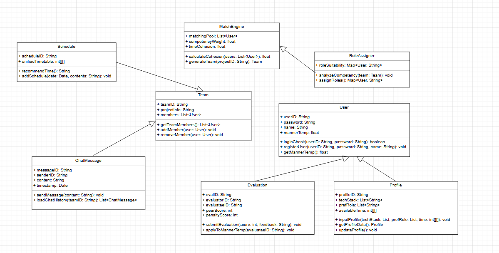
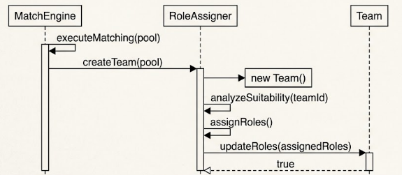
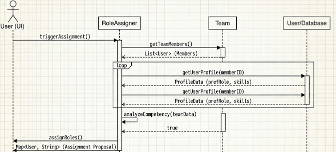

# 3. Design

TeamPLus – 팀플 매칭 및 역할 분배 시스템

## [ Revision History ]

| Revision date | Version # | Description | Author |
|---|---|---|---|
| 2026/06/05 | 1.0.0 | 초안 |  |

---

## Contents

1. Introduction
2. Class diagram
3. Sequence diagram
4. State machine diagram
5. Implementation requirements
6. Glossary
7. References

---

## 1. Introduction

TeamPLus 시스템은 대학교 내 팀 프로젝트를 진행할 때 겪는 팀 구성, 역할 분배, 일정 조율의 어려움을 해결하기 위해 고안된 플랫폼이다. Analysis 단계에서 도출된 요구사항과 도메인 모델을 바탕으로, 실제 시스템 구현에 직접적으로 관여하는 요소들을 확정하고 구체화하는 Design 단계를 다룬다. 본 문서는 시스템의 Class 구조, 기능별
Sequence, 전체 상태 변화를 나타내는 State Machine, 그리고 시스템 구축을 위한 환경적 요구사항을 정의한다.

---

## 2. Class diagram

1) User
사용자 계정 및 인증을 담당하는 클래스입니다.

Attributes
+ userID: String: 사용자 고유 ID (이메일)
+ password: String: 암호화된 비밀번호
+ name: String: 사용자 이름 및 닉네임
+ mannerTemp: float: 매너 온도 (평가 기반 신뢰도)

Methods
+ loginCheck(userID: String, password: String): boolean: 로그인 유효성 검사
+ registerUser(userID: String, password: String, name: String): void: 신규 회원 등록
+ getMannerTemp(): float: 현재 매너 온도 반환

2) Profile
매칭의 핵심 데이터인 개인의 역량 및 시간표 정보를 관리합니다.

Attributes
+ profileID: String: 프로필 고유 ID
+ techStack: List<String>: 전공 능력 및 기술 스택 (상/중/하)
+ prefRole: List<String>: 선호 역할 (기획, 개발 등)
+ availableTime: int[][]: 주간 가용 시간표 데이터

Methods

+ inputProfile(techStack: List, prefRole: List, time: int[][]): void: 프로필 정보 입력 및 저장
+ updateProfile(): void: 기존 프로필 정보 수정
+ getProfileData(): Profile: 프로필 정보 반환

3) MatchEngine
데이터를 분석하여 최적의 팀을 자동으로 구성하는 핵심 알고리즘 클래스입니다.

Attributes
+ matchingPool: List<User>: 매칭 대기열 사용자 목록
+ competencyWeight: float: 역량 가중치 기준값
+ timeCohesion: float: 최소 시간 중첩도 기준값

Methods

+ calculateCohesion(users: List<User>): float: 선택된 사용자 간의 시간 중첩도 계산
+ generateTeam(projectID: String): Team: 조건에 부합하는 조합으로 팀 엔티티 생성 및 반환

4) Team
생성된 팀의 정보와 소속 팀원을 관리합니다.

Attributes
+ teamID: String: 팀 고유 ID
+ projectInfo: String: 프로젝트/강의 정보
+ members: List<User>: 팀원 목록

Methods
+ getTeamMembers(): List<User>: 팀원 목록 반환
+ addMember(user: User): void: 팀원 추가
+ removeMember(user: User): void: 팀원 탈퇴 (페널티 부여 연계)

5) RoleAssigner
구성된 팀 내에서 최적의 역할을 자동 분배합니다.

Attributes
+ roleSuitability: Map<User, String>: 사용자별 역할 적합도 점수 맵핑 데이터

Methods
+ analyzeCompetency(team: Team): void: 팀원 간 역량 및 선호도 중복 분석
+ assignRoles(): Map<User, String>: 최종 자동 배정안(Auto+Assignment Proposal) 생성 및 반환

6) Schedule
팀원 간 통합 일정 및 공통 시간을 관리합니다.

Attributes
+ scheduleID: String: 일정 고유 ID
+ unifiedTimetable: int[][]: 팀원 통합 가용 시간표

Methods
+ recommendTime(): String: 가장 중첩도가 높은 모임 시간 추천
+ addSchedule(date: Date, contents: String): void: 확정된 일정 공유 캘린더에 추가

7) ChatMessage
팀원 간의 의사소통 및 파일 공유를 담당합니다.

Attributes
+ messageID: String: 메시지 고유 번호
+ senderID: String: 발신자 ID
+ content: String: 텍스트 내용 또는 파일 경로
+ timestamp: Date: 전송 시간

Methods
+ sendMessage(content: String): void: 메시지 전송 및 서버 저장
+ loadChatHistory(teamID: String): List<ChatMessage>: 기존 활동 로그 불러오기

8) Evaluation
프로젝트 종료 후 상호 검증 평가를 처리합니다.

Attributes
+ evalID: String: 평가 고유 ID
+ evaluatorID: String: 평가자 ID
+ evaluateeID: String: 피평가자 ID
+ peerScore: int: 기여도 점수
+ penaltyScore: int: 페널티 지수 (무임승차 등)

Methods
+ submitEvaluation(score: int, feedback: String): void: 평가 제출
+ applyToMannerTemp(evaluateeID: String): void: 수집된 평가를 피평가자의 매너 온도에 최종 반영

## 3. Sequence diagram

### 3.1 Team Matching Sequence

User가 UI의 매칭 시작 버튼을 클릭합니다.
UI는 MatchEngine 객체의 generateTeam() 메서드를 호출합니다.
MatchEngine은 데이터베이스(또는 Profile 객체)에서 matchingPool 리스트를 가져옵니다.
반복문(Loop)을 통해 각 User의 calculateCohesion() 및 역량 가중치를 계산합니다.
조건이 충족되면 Team 객체를 생성(new Team())하고, 팀원들에게 매칭 완료 알림(Return)을 보냅니다.

### 3.2 Role Assignment Sequence

팀 매칭 완료 후, 시스템(또는 User의 요청)에 의해 RoleAssigner가 트리거됩니다.
RoleAssigner는 Team 객체로부터 getTeamMembers()를 호출하여 팀원 리스트를 확보합니다.
각 팀원의 Profile 데이터(선호 역할, 기술 수준)를 조회하여 analyzeCompetency() 로직을 수행합니다.
우선순위에 따라 배정안을 생성한 후 assignRoles() 결과를 UI에 출력하여 사용자에게 제안합니다.
---

## 4. State machine diagram

1. **Launch System**: 시스템이 구동된 최초의 상태이며, 비인증 사용자가 접근 시 'Wait Login / Register' 상태로 즉각 전이됩니다.
2. **Wait Login / Register**: 사용자의 ID와 비밀번호를 검증하는 상태입니다. 회원이 아닐 경우 'Register Member' 창으로 이동하며, 입력 누락이나 중복 아이디 발견 시 실패 메시지와 함께 가입 단계에 머무릅니다. 성공 시 'Portal' 상태로 전이됩니다.
3. **Portal (Main)**: 시스템의 허브 상태입니다. 사용자가 매칭 시스템을 이용하기 전, 선행 조건인 'Input Profile' 상태로 진입하게 유도합니다.
4. **Input Profile**: 기술 스택과 가용 시간표를 레이어에 입력하는 상태입니다. 제약 조건 `BR-01`(최소 1개 이상의 스택 및 시간표 등록)이 만족되어 `verifyCompleteness() == true`가 되면 'Waiting Matching' 상태로 전환됩니다.
5. **Waiting Matching**: 매칭 대기열(Pool)에서 알고리즘이 구동되기를 기다리는 상태입니다. 시스템 측에서 시간 중첩도 주당 3시간 이상(`BR-02`) 및 역량 가중치 균형이 맞는 조합을 찾아내는 순간 'Team Matched & Role Assigned' 상태로 자동 전이됩니다.
6. **Workspace Active**: 팀 매칭과 역할 자동 배정 제안이 끝난 직후 전환되는 협업 상태입니다. 이 상태 내에서 사용자는 지속적으로 `Chat` 메시지를 송수신하여 활동 로그를 남기거나 `Schedule`을 생성 및 변경할 수 있습니다.
7. **Evaluation Phase**: 프로젝트가 공식적으로 종료되었을 때 진입하는 상호 검증 평가 상태입니다. 구성원들은 익명성이 보장된 환경에서 기여도 점수와 무임승차 여부를 체크합니다.
8. **Apply Score & End**: 모든 평가 데이터가 취합 완료되면 시스템은 각 피평가자의 페널티 지수를 계산하여 '매너 온도'에 최종 합산 반영하고, 해당 팀 엔티티의 수명을 종료(해산)시킵니다.

## 5. Implementation requirements

### 1) Hardware Requirements
| 항목 | 사양 |
| :--- | :--- |
| CPU | 2.0 GHz 이상의 듀얼 코어 프로세서 |
| RAM | 4 GB 이상 |
| Storage | 1 GB 이상의 여유 공간 |
| Network | 인터넷 연결 필수 |

### 2) Software Requirements
| 항목 | 사양 |
| :--- | :--- |
| OS | Windows 10 이상 / macOS 11 이상 / Linux |
| Web Browser | Chrome, Firefox, Safari, Edge 최신 버전 |

---

## 6. Glossary

| Terms | Description |
|---|---|
| **Class Diagram** | 시스템의 논리 설계를 위해 클래스의 내부 속성, 오퍼레이션, 그리고 상속/의존 등의 정적 관계를 도식으로 표현한 구조 다이어그램. |
| **Sequence Diagram** | 특정 유스케이스나 기능 시나리오 흐름에 따라 객체 간에 주고받는 메시지의 시간적 순서를 시각화한 동적 흐름 다이어그램. |
| **State Machine Diagram** | 단일 객체나 시스템 전체가 가질 수 있는 유한한 상태들과, 외부 자극(이벤트)에 의해 발생하는 상태 간의 전이 규칙을 나타낸 다이어그램. |
| **Attributes** | 객체지향 프로그래밍 아키텍처에서 클래스 내부에 선언되어 고유한 상태 값을 보관하는 속성 또는 멤버 변수. |
| **Methods / Operations** | 클래스 혹은 객체에 소속되어 특정 비즈니스 로직이나 데이터 처리를 수행하는 함수 또는 서브루틴. |

---

## 7. References

